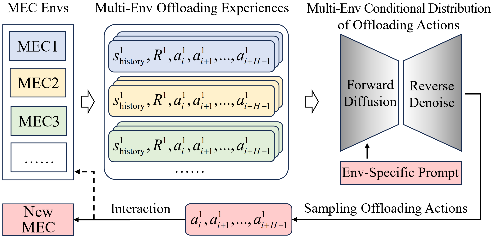

# DiffLoader

DiffLoader: Environment-Adaptive Computation Offloading via Generative Prompt-Conditional Planning

## Abstract

Facing the rapid development of both user equipment (UE) and mobile applications, mobile edge computing (MEC) emerged as a new paradigm to furnish UE with satisfactory computational capability and task latency. Studies on MEC have put a great deal of focus on computation offloading, mainly involving multi-step task offloading and resource allocation (OffAll) which is mostly nontrivial. Concerning the heavy burden of online OffAll optimization on scalability and efficiency, offline learning-based OffAll approaches are of high popularity. However, most existing learning-based OffAll is still short of generalizability and adaptability across different MECs, thus difficult for general-purpose application. Inspired by the remarkable success of LLMs for their impressive generalization ability across different tasks by conditioning on instructions or prompts, this paper proposes a diffusion-based OffAll approach (termed DiffLoader) by utilizing the generative conditional-planning ability of diffusion models learned from multi-MEC OffAll experiences. Specifically, we everage a few-shot trajectory of MEC states transitions as MECspecific prompts, adopt diffusion to learn multi-MEC conditional OffAll distribution, and generate OffAll decisions via distributionsampling during execution. We conduct extensive experiments to verify the advantages of DiffLoader over state-of-the-art learningbased multi-MEC OffAll approaches, and also show the compositive generating ability of DiffLoader even for unseen MEC.

## Method

<p align="center">
  <br><br>
</p>
<p align="center"> The schematic of diffusion-based multi-Env offloading. </p>

<p align="center">
  <br><br>
</p>
<p align="center">Model architecture of DiffLoader $\pi_θ$ (green-shadowed box). </p>

<p align="center">
  <br><br>
</p>
<p align="center"> Performance comparisons in In-Distribution Envs. </p>

## Usage:

To train DiffLoader:

```bash
python scripts/diffloader_mec.py --model models.Tasksmeta --diffusion models.GaussianActDiffusion --loss_type statehuber --loader datasets.RTGActMecDataset
```

To train SACLoader:

```bash
python sac_loader.py
```

To train MoELoader:

```bash
python moe_loader.py
```

To train MetaLoader:

```bash
python meta_loader.py --num-workers 1 --fast-lr 0.1 --max-kl 0.01 --fast-batch-size 1 --meta-batch-size 40 --num-layers 2 --hidden-size 100 --num-batches 10000 --gamma 0.99 --tau 1.0 --cg-damping 1e-5 --ls-max-steps 15 --output-folder maml-mec-dir --device cuda --env-name MetaLoader
```

To train MTLoader:

```bash
python scripts/mt_loader.py --config mt_mec/mt_config/modular.json --id MTLoader
```

